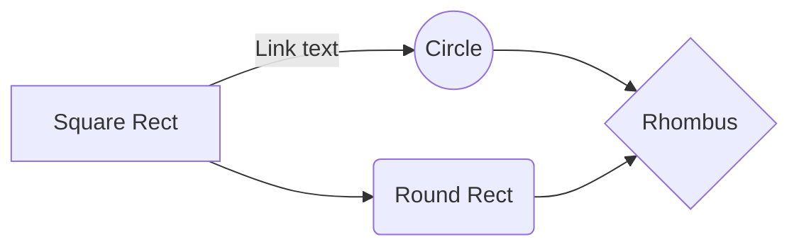

i'm on 

    03-PROCESS-finding-their-hidden-needs-digging-into-their-solutions/06-how-2-tlk-2-usrs/06-finding-bst-trgt-usrs-to-mold-ur-prdct
        you're putting this into 11 Questions to ask during interview

    move h3 sections indented over from h2 sections, and so on

        finished introduction
        

            

            

        

    04-why-fin-usrs will be first part of Interviewing prospective customers

    05-how-fin-usrs-2-interv will be second part of Interviewing prospective customers

    06-finding-bst-trgt will be in the Reflect section

        you want to add this part to the google workbook

make a quiz, suggest parts for them to read if they answer a certain way

quiz

do you have recurring users, customers?

yes
    -> 

no
    -> 

follow me on twitter
    bottom of pmf guide

top should be go back to my blog link

https://read.activelylearn.com/#teacher/reader/authoring/preview/717432/notes

strtup boost newsletter - jason said he'd put it in there

https://getbootstrap.com/2.3.2/components.html

https://twitter.com/gaganbiyani/status/1308062970921078784

prototype

    use webflow

    google forms, typeforms whatever

    zapier

    and manually do your service

----------------------
create a svg with https://mermaid-js.github.io/mermaid-live-editor

----------------------

https://www.emojibase.com/emojis-on-twitter

http://getemoji.com/