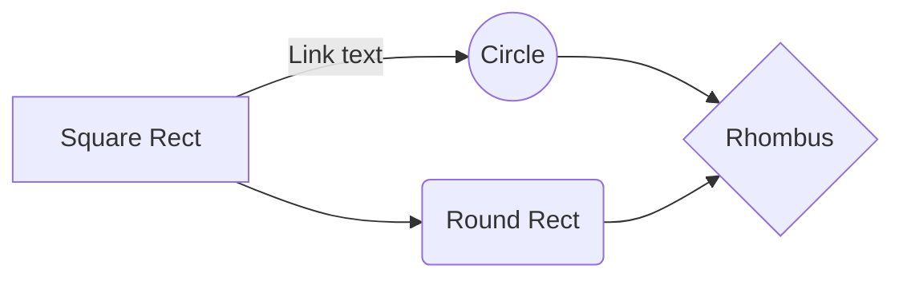

i'm on 03-PROCESS-finding-their-hidden-needs-digging-into-their-solutions/01-uncovering-hidden-needs-from-target-users.txt (line 27)

I really like how the quiz is embedded with the content

	it would be cool if there were two checkmarks at the top of the table of contents

	content
	quiz

	this way they can uncheck the content part and take the quiz

		maybe this is too confusing 

			yeah it is

https://read.activelylearn.com/#teacher/reader/authoring/preview/717432/notes

strtup boost newsletter - jason said he'd put it in there

https://getbootstrap.com/2.3.2/components.html

https://twitter.com/gaganbiyani/status/1308062970921078784

prototype

	use webflow

	google forms, typeforms whatever

	zapier

	and manually do your service

----------------------
create a svg with https://mermaid-js.github.io/mermaid-live-editor

----------------------

quiz

do you have recurring users, customers?

yes
	-> 

no
	-> 

