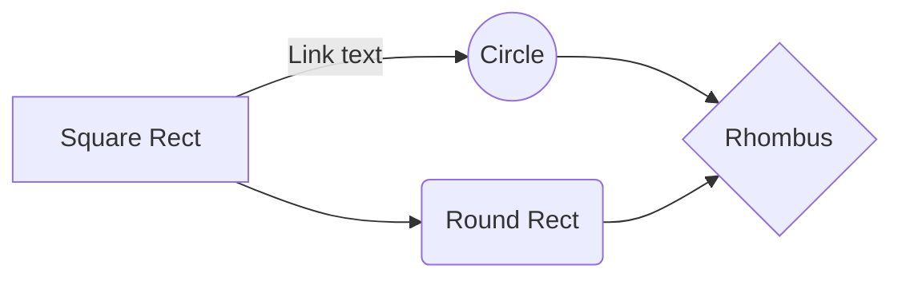

i'm on 03-PROCESS-finding-their-hidden-needs-digging-into-their-solutions/03-develop-market-thesis.txt

make a quiz, suggest parts for them to read if they answer a certain way

quiz

do you have recurring users, customers?

yes
	-> 

no
	-> 

https://read.activelylearn.com/#teacher/reader/authoring/preview/717432/notes

strtup boost newsletter - jason said he'd put it in there

https://getbootstrap.com/2.3.2/components.html

https://twitter.com/gaganbiyani/status/1308062970921078784

prototype

	use webflow

	google forms, typeforms whatever

	zapier

	and manually do your service

----------------------
create a svg with https://mermaid-js.github.io/mermaid-live-editor

----------------------

