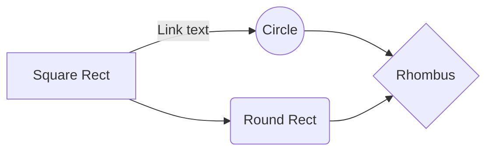

I really like how the quiz is embedded with the content

	it would be cool if there were two checkmarks at the top of the table of contents

	content
	quiz

	this way they can uncheck the content part and take the quiz

		maybe this is too confusing 

			yeah it is

https://read.activelylearn.com/#teacher/reader/authoring/preview/717432/notes

strtup boost newsletter - jason said he'd put it in there

https://getbootstrap.com/2.3.2/components.html

https://twitter.com/gaganbiyani/status/1308062970921078784

prototype

	use webflow

	google forms, typeforms whatever

	zapier

	and manually do your service

----------------------
create a svg with https://mermaid-js.github.io/mermaid-live-editor

----------------------

                Example: zuckerberg made facebook when he was in college. It was perfect for college students because college kids meet new people ALL THE TIME, and facebook was perfect for them. If facebook launched for highschool or the workplace, it wouldn't have worked as well because highschool kids stay in the same cliques and don't meet new people, and adults are boring and never meet anyone new. College kids are constantly meeting new people while taking new classes, going to parties, doing intramural activities, walking to class, getting food at the dining hall, working out at the gym, going to a football/basketball game, studying at the library, doing laundry, etc. 
